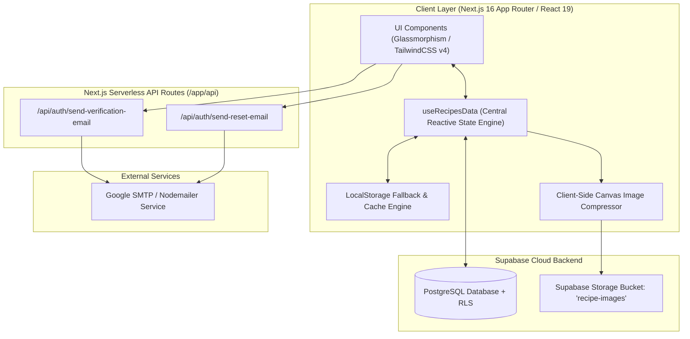
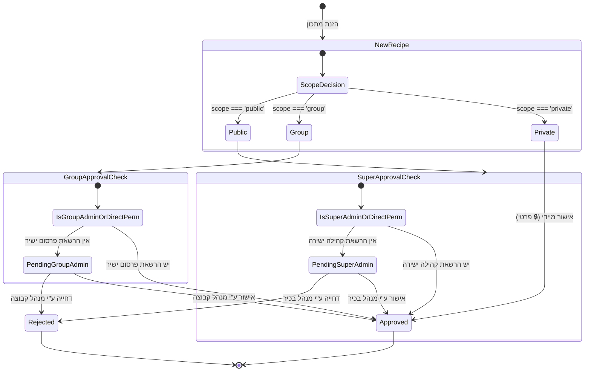

# 📐 System Architecture & Engineering Deep Dive

## Weekly Planner & Lifestyle Hub

---

## 🏛️ 1. מבט-על ארכיטקטוני (High-Level Architecture)

המערכת בנויה בארכיטקטורת **Hybrid Local-First + Serverless Cloud Sync**, המספקת אפס השהיות (Zero Latency) למשתמש הקצה, עבודה חלקה במצב לא-מקוון (Offline-First), וסנכרון רציף לענן כאשר קיים חיבור רשת תקין.



---

## 🔒 2. מודל בידוד נתונים מרובה קבוצות (Multi-Tenant Group Scoping Engine)

האפליקציה מיישמת מודל בידוד נתונים קפדני (Multi-Tenancy) המבטיח שאף משתמש אינו יכול לגשת או לצפות במידע פרטי של משתמש אחר או של קבוצה שאינו חבר בה.

### פונקציית הבידוד המרכזית: `isItemVisible`

```typescript
const isItemVisible = (item: { 
  createdBy?: string; 
  creatorEmail?: string; 
  userId?: string; 
  groupId?: string; 
  isShared?: boolean; 
  is_public?: boolean;
  status?: RecipeModerationStatus;
}): boolean => {
  // 1. אורח: רואה אך ורק פריטי מערכת מובנים (System Starter Items)
  if (!currentUser || currentUser.isGuest) {
    return !item.createdBy && !item.userId && !item.groupId;
  }

  // 2. מנהל בכיר (Super Admin): רואה הכל לצורכי פיקוח ובקרה
  if (currentUser.isSuperAdmin) return true;

  // 3. יוצר הפריט (Owner): רואה תמיד את הפריטים שלו (כולל פריטים הממתינים לאישור או שנדחו)
  const isOwner = Boolean(
    (item.createdBy && item.createdBy === currentUser.id) ||
    (item.userId && item.userId === currentUser.id) ||
    (item.creatorEmail && item.creatorEmail.toLowerCase() === currentUser.email?.toLowerCase())
  );
  if (isOwner) return true;

  // 4. פריט שנדחה (Rejected): מוסתר מכל שאר המשתמשים
  if (item.status === 'rejected') return false;

  // 5. פריטי ברירת מחדל של המערכת: גלויים לכולם
  const isSystemDefault = !item.createdBy && !item.userId && !item.groupId;
  if (isSystemDefault) return true;

  // 6. מתכונים ציבוריים לקהילה (🌐): גלויים רק לאחר אישור (status === 'approved')
  if (item.is_public === true) {
    return item.status === 'approved' || item.status === undefined;
  }

  // 7. פריטים קבוצתיים (👥): גלויים אך ורק לחברי הקבוצה הפעילה
  if (activeGroup) {
    const isTargetGroup = item.groupId === activeGroup.id;
    const isGroupAdmin = activeGroup.createdBy === currentUser.id;

    // מנהל הקבוצה יכול לראות פריטים הממתינים לאישורו בקבוצה
    if (isTargetGroup && isGroupAdmin && item.status === 'pending_group_admin') {
      return true;
    }

    // חברי קבוצה רגילים רואים רק פריטים שאושרו ושאינם פרטיים
    const isApprovedForGroup = item.status === 'approved' || item.status === undefined;
    if (isTargetGroup && item.isShared !== false && isApprovedForGroup) {
      return true;
    }
  }

  // 8. ברירת מחדל: מוסתר מוחלטת
  return false;
};
```

---

## 🛡️ 3. צינור מודרציה ואישורי תוכן (Moderation Pipeline)



---

## 🗄️ 4. סכמת מסד הנתונים ב-Supabase (Database Schema & RLS)

### טבלאות מרכזיות:

1. **`recipes`**:
   - `id (text, PK)`
   - `title (text)`
   - `description (text)`
   - `ingredients (jsonb / text[])`
   - `instructions (text)`
   - `category (text)`
   - `prep_time (text)`
   - `image_url (text)`
   - `is_public (boolean)`
   - `isShared (boolean)`
   - `groupId (text, nullable)`
   - `createdBy (text)`
   - `creatorName (text)`
   - `creatorEmail (text)`
   - `status (text: 'approved' | 'pending_super_admin' | 'pending_group_admin' | 'rejected')`
   - `ratings (jsonb)`
   - `comments (jsonb)`
   - `created_at (timestamp with time zone)`

2. **`meal_planner`**:
   - `id (text, PK)`
   - `day (text)`
   - `meal (text)`
   - `recipeId (text, nullable)`
   - `customName (text, nullable)`
   - `items (jsonb, multi-course sub items)`
   - `weekOffset (integer)`
   - `weekKey (text)`
   - `completed (boolean)`
   - `isShared (boolean)`
   - `groupId (text, nullable)`
   - `userId (text)`

3. **`workouts` & `workout_logs`**:
   - `id (text, PK)`
   - `title (text)`, `splitGroup (text)`, `type (text)`, `targetMuscleGroups (text[])`
   - `exercises (jsonb)`
   - `groupId (text, nullable)`, `isShared (boolean)`, `createdBy (text)`

4. **`date_spots`**:
   - `id (text, PK)`, `title (text)`, `category (text)`, `address (text)`, `wazeUrl (text)`, `rating (integer)`, `visitCount (integer)`, `imageUrl (text)`

5. **`tasks`**:
   - `id (text, PK)`, `itemType (text: 'task' | 'note')`, `title (text)`, `description (text)`, `category (text)`, `priority (text)`, `completed (boolean)`, `dueDate (text)`, `dueTime (text)`, `noteColor (text)`

6. **`family_groups` & `group_invitations`**:
   - `id (text, PK)`, `name (text)`, `createdBy (text)`, `members (jsonb: userId, email, role, permissions)`

---

## ⚡ 5. אופטימיזציות ביצועים (Performance Engineering)

1. **דחיסת תמונות בצד לקוח (`compressImage`):**
   - שימוש ב-HTML5 Canvas API לעיבוד מקדים של תמונות (Resize ל-1200px Max Dimension, המרה ל-JPEG באיכות 0.82).
   - חוסך תעבורת רשת של עד 85% ומאפשר טעינת תמונות מיידית גם בחיבורי סלולר אטיים.

2. **אינדוקס שבועות במתכנן (`getWeekKey`):**
   - שימוש במפתח שבוע ייחודי (`YYYY-WW`) לחיתוך רשימות והפחתת זיכרון.

3. **שקלול רשימת קניות ממוטב (`useMemo`):**
   - אלגוריתם O(N) למיזוג רכיבים בעלי אותה יחידת מידה ושם רכיב.

---

## 🔐 6. אבטחה והגנה מפני פרצות (Security Posture)

- **מניעת Cross-Site Scripting (XSS):** כל המחרוזות המוזנות ע"י משתמשים עוברות רינדור בטוח ב-React Virtual DOM עם escaping מובנה.
- **הגנה על משתני סביבה:** מפתחות שרת (כגון SMTP Credentials) מוגדרים ללא קידומת `NEXT_PUBLIC_` ונגישים אך ורק בסביבת השרת (`Node.js Runtime`).
- **אימות כפול ברישום:** תהליך הרשמה הדורש קוד אימות חד-פעמי (6 ספרות) הנשלח למייל המשתמש.
- **בקרת גישה (RBAC):** בדיקות הרשאה קפדניות בצד השרת ובצד הלקוח לפני מחיקת חשבונות, קבוצות או מתכונים.

---

## 📁 7. מבנה התיקיות של הפרויקט

```
recipes_app/
├── app/
│   ├── api/
│   │   └── auth/
│   │       ├── send-verification-email/route.ts
│   │       └── send-reset-email/route.ts
│   ├── globals.css
│   ├── layout.tsx
│   └── page.tsx
├── src/
│   ├── components/
│   │   ├── auth/          # AuthModal, GroupManagementModal, ResetPasswordModal
│   │   ├── common/        # AboutAppModal, ItemScopeBadge, PublishScopeSelector
│   │   ├── dates/         # DatesTab, DateSpotFormModal
│   │   ├── fitness/       # FitnessTab, WorkoutFormModal, WorkoutDetailModal
│   │   ├── layout/        # Header, InvitationsBanner, TabSettingsModal
│   │   ├── planner/       # MealPlannerTab, AssignMealModal
│   │   ├── recipes/       # RecipesTab, RecipeCard, RecipeDetailModal, RecipeFormModal
│   │   ├── shopping/      # ShoppingListTab, SaveListModal
│   │   └── tasks/         # TasksTab, TaskFormModal, TaskDetailModal
│   ├── constants/         # default starter data & category options
│   ├── hooks/             # useRecipesData.ts (Primary state engine)
│   ├── lib/               # supabaseClient.ts, mailer.ts
│   ├── types/             # index.ts (Strict TypeScript definitions)
│   └── utils/             # imageUtils, ingredientUtils, dateUtils, taskUtils
├── ARCHITECTURE.md
├── README.md
├── package.json
└── tsconfig.json
```

---

<div align="center">
  <sub>Documented according to top-tier enterprise software engineering standards.</sub>
</div>
